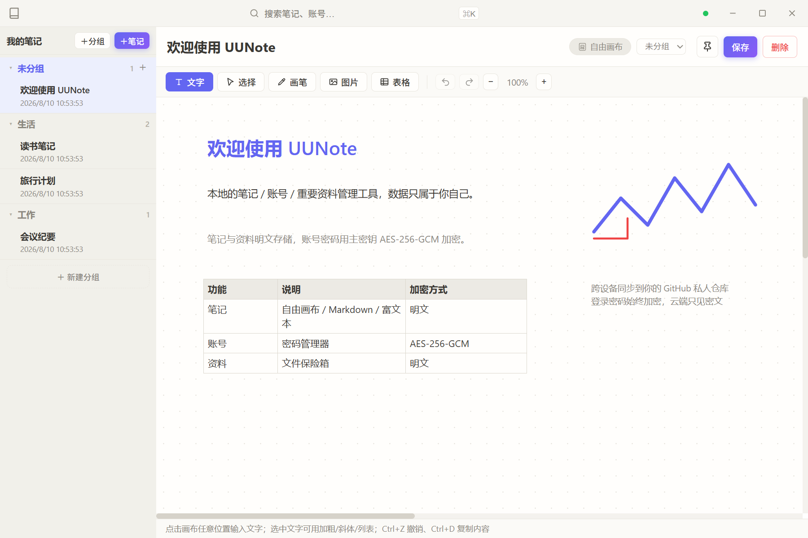
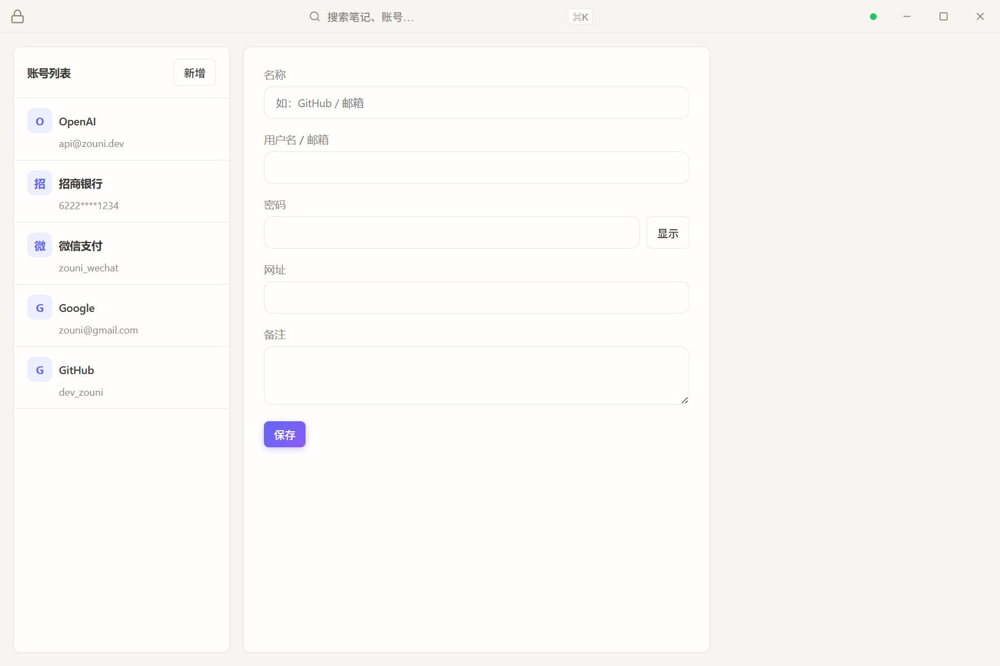
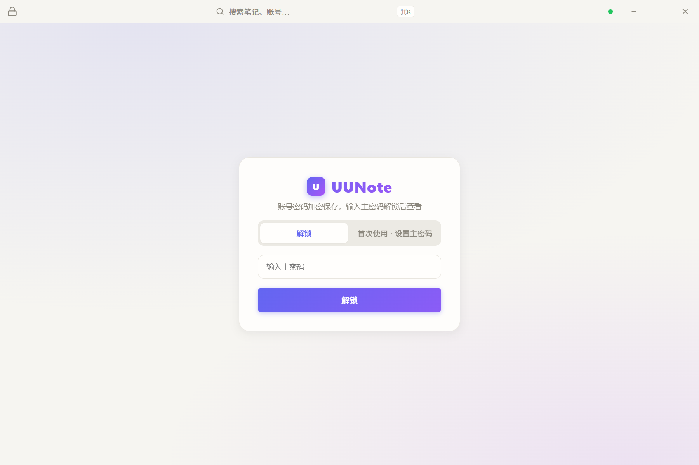
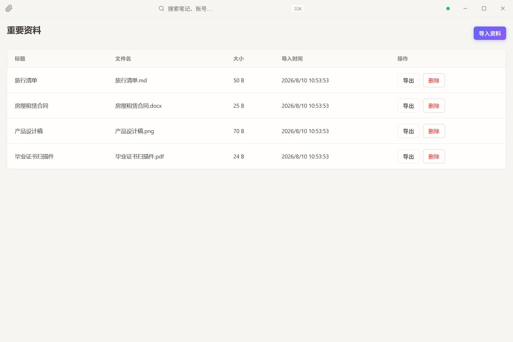
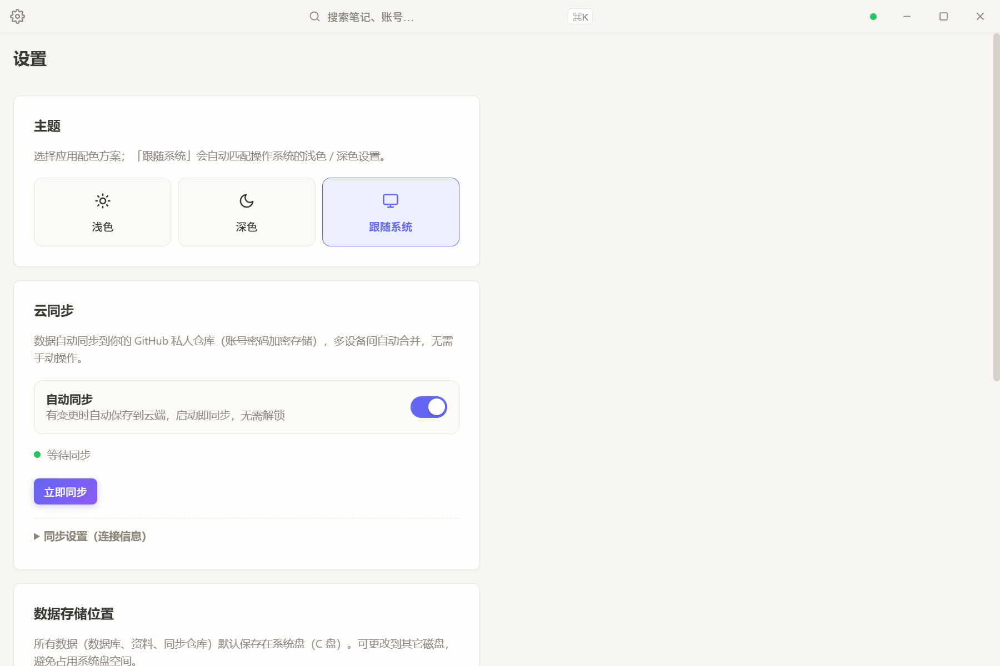
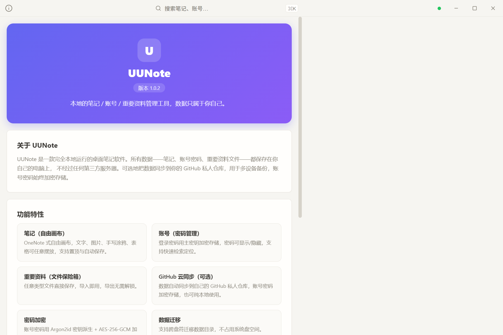

# UUNote

> 本地优先的笔记 / 账号 / 重要资料管理工具，数据只属于你自己。

UUNote 是一款完全本地运行的桌面笔记软件。你的所有数据——笔记、账号密码、重要资料文件——都保存在你自己的电脑上，**不经过任何第三方服务器**。可选地把数据同步到你的 **GitHub 私人仓库**，用于多设备备份。笔记与资料为明文同步，账号密码始终加密，云端永远看不到你的密码明文。

## 截图预览

| 笔记（自由画布） | 账号（密码管理） |
| --- | --- |
|  |  |

| 账号页解锁门 | 重要资料（文件保险箱） |
| --- | --- |
|  |  |

| 设置（GitHub 云同步） | 关于 |
| --- | --- |
|  |  |

## 为什么选择 UUNote

- **不依赖后端服务，不怕"软件跑路"**
  所有数据都是你本地的普通文件（SQLite 数据库 + 明文文件），不依赖任何云服务商。即使项目停止维护，你的数据也完整地躺在自己电脑上，随时可查看、可迁移。

- **隐私安全，只加密真正敏感的内容**
  笔记与资料明文保存、打开即用；只有账号密码使用主密码派生的密钥加密落盘。主密钥只存在内存中，从不写入磁盘，即使数据库文件被拷走，没有主密码也无法解密密码字段。

- **加密算法公开透明**
  使用行业标准的 Argon2id 密钥派生 + AES-256-GCM 对称加密，代码完全开源，任何人可以审查加密实现，不存在"后门"。

- **开源免费**
  Apache-2.0 协议开源，代码可审查、可自行构建。

## 功能

### 笔记（自由画布）

OneNote 式自由画布笔记，可以在任意位置摆放：

- 文字块（可调字号、颜色）
- 图片
- 手写涂鸦
- 表格

支持笔记置顶、防抖自动保存、实时保存状态提示；也提供 Markdown 与富文本两种编辑模式。

### 账号（密码管理）

管理各类网站/服务的登录信息：

- 名称、用户名/邮箱、密码、网址、备注
- 密码用主密钥加密存储（AES-256-GCM），编辑时可显示/隐藏
- 列表快速检索定位
- 进入账号页需要主密码解锁，其余页面免解锁访问

### 重要资料（文件保险箱）

把重要文件放进本地资料库：

- 支持任意类型文件（PDF、图片、Office 文档、压缩包等）
- 明文直接保存，导入即用，导出无需解锁
- 不占用系统盘时可将数据目录迁移到其它磁盘

### GitHub 云同步（可选）

不想要同步也可以，纯本地使用完全没问题。需要多设备备份时：

- 数据同步到**你自己的 GitHub 私人仓库**，笔记/资料为明文，账号密码字段始终加密
- 应用启动即自动同步，无需解锁（明文数据不依赖主密钥）
- 增量操作日志 + 快照自动压缩，跨设备按 Lamport 时钟合并，删除以墓碑传播
- 内嵌 git2 库，无需在系统安装 git
- Token 保存到 Windows 凭据管理器，不写进任何文件
- 自动使用 Windows 系统代理，或手动指定代理

## 技术栈

| 层 | 技术 |
|---|---|
| 桌面框架 | Tauri 2 |
| 前端 | React + TypeScript + Vite |
| 后端 | Rust |
| 存储 | SQLite（rusqlite，bundled 免系统依赖） |
| 加密 | argon2（Argon2id）+ aes-gcm（AES-256-GCM） |
| 同步 | git2（vendored-libgit2，免系统安装 git） |
| 凭据存储 | keyring（Windows 凭据管理器） |

## 使用教程

### 运行环境

- Node.js（建议 18+）
- Rust（建议 1.75+，含 `cargo`）
- Windows 10/11（内置 WebView2）

### 安装依赖并启动

```bash
npm install
npm run tauri dev
```

首次启动会编译 Rust 后端，稍等片刻即可打开应用窗口。

### 构建安装包

```bash
npm run tauri build
```

### 第一次使用：设置主密码

应用启动即可直接使用笔记与资料；**首次进入「账号」页**时需设置一个主密码，这是账号密码加密的根密钥：

- 请务必牢记主密码，**忘记后无法找回**（没有任何找回渠道，也不会上传云端）
- 主密码仅用于解锁账号页，不会离开你的电脑
- 已设置过主密码的设备，再次进入账号页时输入主密码解锁即可

### 使用笔记

1. 左侧点击「我的笔记」→「新建」
2. 在画布上双击/点击任意位置书写文字，或通过工具栏插入图片、涂鸦、表格
3. 内容自动防抖保存，也可以随时点「保存」
4. 点击「置顶」可将常用笔记固定到列表顶部

### 管理账号

1. 切换到「账号」页，输入主密码解锁（首次使用为设置主密码）
2. 「新增」并填写名称、用户名/邮箱、密码、网址、备注后保存
3. 密码默认隐藏，点「显示」可查看明文（仅供你自己本机查看）
4. 点击左侧列表项可编辑或删除

### 存入重要资料

1. 切换到「资料」页 →「导入资料」
2. 选择本地文件，应用会直接保存到资料库（明文，无需解锁）
3. 需要使用时点「导出」，选择保存位置即可获得原文件

### 配置 GitHub 云同步

1. 在 GitHub 上创建一个**私人仓库**（Private），记下仓库地址
2. 生成 Personal Access Token（`GitHub → Settings → Developer settings → Personal access tokens`，勾选 `repo` 权限）
3. 打开「设置 → 云同步」：
   - **仓库地址**：填入仓库地址，如 `https://github.com/用户名/仓库名.git`
   - **Token**：粘贴刚生成的 Token（保存后写入 Windows 凭据管理器，界面不再回显）
   - **分支**：默认 `main`，一般不用改
   - **Git 代理（可选）**：留空会自动使用 Windows 系统代理；如使用代理软件但未开启「系统代理」模式，可手动填代理地址，如 `http://127.0.0.1:7890`
4. 点「保存配置」，应用会自动同步一次（远程为空仓库时自动初始化推送）
5. 之后每次增删改数据都会自动提交并推送；应用启动即自动同步，换设备时在另一台设备同样配置即可

> 说明：同步到云端的是明文数据（仅账号密码字段加密），请务必使用**私人仓库**。只要在另一台设备上输入相同的主密码，即可解密账号密码。

### 修改主密码

「设置 → 修改主密码」中填写原密码和新密码。修改后账号密码会用新密钥重新加密（笔记与资料为明文，无需重加密），之后用新密码解锁账号页。

### 更改数据存储位置

默认数据存放在系统盘应用数据目录。若想放到其它磁盘：

1. 「设置 → 数据存储位置」→「选择新位置」
2. 选择一个**空目录**，应用会把数据库、资料、同步仓库整体迁移过去（支持跨盘符）
3. 迁移立即生效，下次启动自动使用新位置

## 许可证

[Apache-2.0](LICENSE)
